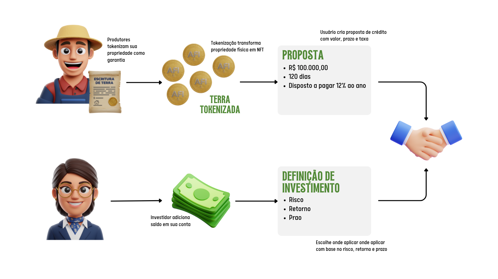
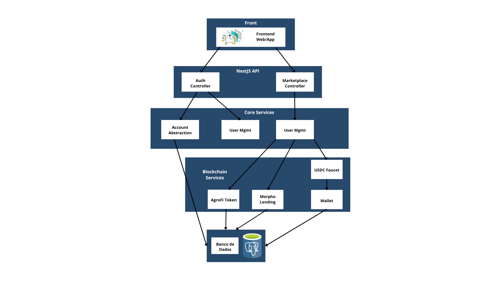

# Plataforma P2P Lending Agro com Blockchain, Account Abstraction e ML

## Contextualização
O agronegócio brasileiro é um dos pilares da economia nacional, representando **24,8% do PIB em 2023** e movimentando aproximadamente **R$ 364,8 bilhões em crédito rural** na safra 2023/2024. Apesar desses números expressivos, pequenos e médios produtores rurais – que representam **77% dos estabelecimentos agropecuários** segundo o Censo Agropecuário 2017 do IBGE – enfrentam barreiras significativas no acesso ao crédito.

As taxas de juros praticadas pelo sistema bancário tradicional para crédito rural livre (não subsidiado) variam entre **12% e 18% ao ano** (Banco Central). Além disso, o processo de concessão é marcado por exigências burocráticas extensas (garantias reais, seguros obrigatórios) e análises que podem levar **45 a 90 dias** para aprovação. Esse atraso limita a expansão dos pequenos produtores, especialmente pelo descasamento temporal entre investimento no plantio e receita da comercialização (ciclos de **6 a 12 meses** conforme a cultura).

## A Oportunidade Tecnológica e de Mercado
O número de investidores pessoa física na B3 ultrapassou **5 milhões em 2023**, muitos buscando diversificação além da renda fixa. Globalmente, o mercado de P2P lending foi avaliado em **US$ 85,4 bilhões em 2022** e deve crescer a **CAGR de 24,9% até 2030** (Grand View Research). A convergência de **blockchain**, **contratos inteligentes** e **machine learning** cria oportunidade para redesenhar o crédito agrícola.

- Blockchain: transparência, imutabilidade e redução de custos de intermediação.
- Smart Contracts: automação de acordos financeiros sem intermediários (redução de 30–40% de custo operacional segundo WEF).
- Machine Learning: análise de risco e validação documental acelerando processos que antes levavam semanas.

## Aplicação e Fluxos
O fluxo integra tecnologia, confiança e acessibilidade financeira em uma jornada única. Cada etapa conecta perfis (produtor ↔ investidor) e reduz atritos.

</img>

### Criação de Conta com Account Abstraction
Uso de um modelo simplificado de Account Abstraction: usuário cria conta apenas com e-mail/senha; a carteira é gerada e abstraída (não lida diretamente com chaves privadas na UX). A complexidade blockchain fica encapsulada.

<video src="assets/account_abstraction.mp4" controls preload="metadata" style="max-width:100%;height:auto;"></video>

### Validação de Documento com Machine Learning
Após tokenização do ativo (ex.: terra), um modelo ML valida e avalia documentação e dados fundiários, garantindo elegibilidade e consistência. Isso aumenta confiança do investidor, Reduz fraudes e Melhora governança do colateral.

Protegendo os investidores de fraudes:
<video src="assets/machine_learn_nega.mp4" controls preload="metadata" style="max-width:100%;height:auto;"></video>

Trazendo segurança e garantia de confiabilidade do sistema de segurança, usando ML. Que nesse caso aceitou um documento verídico:

<video src="assets/machine_learn_sucesso.mp4" controls preload="metadata" style="max-width:100%;height:auto;"></video>

### Solicitação de Empréstimo
O produtor (após validação) cria uma solicitação definindo valor, prazo e condições. Integração com o protocolo **Morpho** (Ethereum Sepolia / Base Sepolia em modo demonstrativo) estrutura o empréstimo sobre colateral tokenizado.

<video src="assets/solicita_emprestimo.mp4" controls preload="metadata" style="max-width:100%;height:auto;"></video>

### Investimento
Investidores visualizam solicitações abertas e aplicam capital. Colaterais tokenizados aumentam transparência e reduzem assimetria de risco.
<video src="assets/investir.mp4" controls preload="metadata" style="max-width:100%;height:auto;"></video>

### Pagamento do Empréstimo
O produtor quita parcelas / principal conforme contrato. Após quitação, o token da terra (colateral) é liberado e o ciclo se encerra com segurança, rastreabilidade e alinhamento de incentivos.

<video src="assets/pagamento.mp4" controls preload="metadata" style="max-width:100%;height:auto;"></video>

## Estrutura Backend

Abaixo está um diagrama que resume a arquitetura: fluxo entre usuários, frontend, API (NestJS), serviços internos (auth, marketplace, token, lending, faucet, wallet, validação ML) e integrações on-chain (contratos AFI, Morpho, RPC), além da camada de estado em memória que futuramente será substituída por um banco de dados.

</img>

### Estrutura Backend (NestJS / TS)
- Configuração: `nest-cli.json`, `tsconfig*.json`, `package.json`
- Endereços on-chain: `contract-addresses.json` (AFI token etc.)
- Banco de Dados: existe `init.sql`, porém atualmente dados ficam em memória (Maps) para prototipagem

### Base da Aplicação
`main.ts` / `app.module.ts` → Bootstrap da aplicação e registro dos módulos principais.

### Camada HTTP – Controllers
- `auth.controller.ts` → Registro/login, autenticação JWT, smart account simulada.
- `marketplace.controller.ts` → Empréstimos P2P: listagem, investimento, estatísticas, posição.
- Outros Controllers:
	- `afi-token.controller.ts`
	- `morpho.controller.ts`
	- `wallet.controller.ts`
	- `proposal.controller.ts`
	- (e outros complementares ao fluxo principal)

### Camada de Serviço – Lógica de Negócio & Blockchain
- `account-abstraction.service.ts` → Smart Account simplificada (EOA), autenticação e usuários/JWT em memória.
- `user-management.service.ts` → Gestão de usuários (duplicidade parcial com o anterior – pode ser unificado futuramente).
- `marketplace.service.ts` → Orquestração do fluxo P2P off-chain, integração Morpho / AFI / USDC faucet.
- `morpho-lending.service.ts` → Simulação de supply/borrow/liquidação P2P (transações fictícias com metadata na Sepolia).
- `morpho-onchain.service.ts` → Placeholder para integração mais direta com Morpho Blue (ABIs simplificadas / demo).
- `agrofi-token.service.ts` → Integra contrato AFI (mint/burn, funding por R$ → tokens, histórico de investimentos).
- `usdc-faucet.service.ts` → Estratégia multi-fonte (simulada) para prover USDC de teste (Circle, ETHGlobal, fallback master wallet).
- `wallet.service.ts` → Utilidades de carteira (geração, importação, saldos, transferências, estimateGas) focado em Base Sepolia.

### Camada de Entidades e Tipos
- Entities: `user`, `proposal`, `investment` — modelos simples ainda não conectados a ORM.
- Types: `token.types.ts` — ABIs e interfaces de integração on-chain.

## Reestruturação do Projeto Inicial

**Account Abstraction Simplificada**: Implementação de uma smart account simplificada (EOA) para abstrair complexidade de chaves privadas na UX, uma vez que acreditamos que esse fluxo acabaria com a barreira de entrada para nossos usuários, que não vão precisar lidar com a criação de carteiras, que se trata de um fluxo que pode ser considerado complexo pelos usuários finais.

**Tokenização de terra**: Optamos por tokenizar a terra como colateral, ao invés de soja, que se enquadrava no escopo inicial. Acreditamos que a terra como colateral traz mais segurança para o investidor, uma vez que a terra é um ativo mais estável e menos volátil do que a soja, além de não ser um produto perecível.

**Stack Backend Simplificada (NestJS + PostgreSQL)**: Uso de NestJS pela organização modular e rapidez em prototipar; dados ficam no banco PostgreSQL acelerando iterações no hackathon, focando validar fluxo P2P e integrações blockchain.

### Conclusão
No restante, as demais premissas, objetivos de transparência, foco em redução de barreiras de crédito e visão de evolução (on/off-ramp, oráculos, liquidação automatizada, scoring de risco) permanecem iguais ao planejamento original. Esta fase prioriza validação rápida do fluxo núcleo para acelerar os próximos incrementos.

