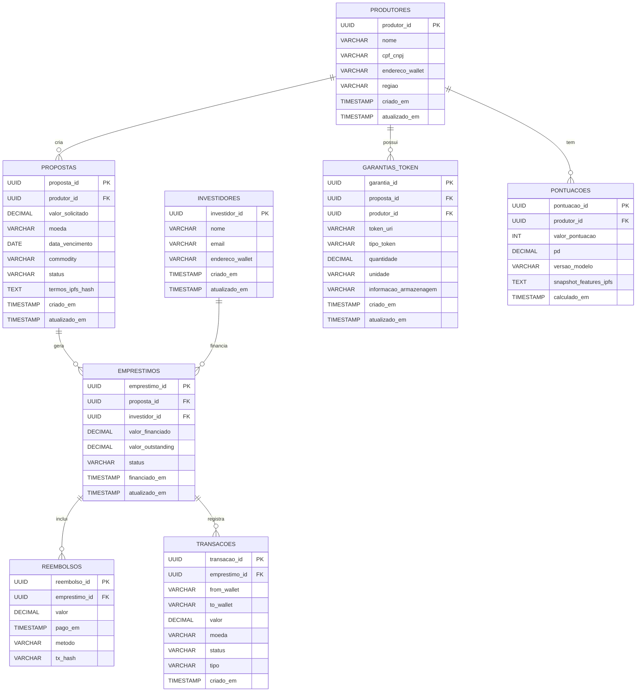

# Contexto

O setor agrícola brasileiro representa um dos pilares fundamentais da economia nacional, movimentando aproximadamente R$ 700 bilhões anuais em crédito rural e sendo responsável por mais de 25% do PIB do país. Pequenos e médios produtores rurais, que compõem a maioria dos estabelecimentos agropecuários brasileiros, enfrentam sistematicamente o desafio do descasamento temporal entre investimentos necessários para o plantio e o retorno financeiro da comercialização da safra. Durante os 6 a 12 meses que compreendem um ciclo produtivo típico, estes produtores necessitam de capital para aquisição de insumos essenciais como sementes certificadas, defensivos agrícolas, fertilizantes e eventualmente locação de maquinário, mas só conseguem gerar receita após a colheita e venda dos produtos.

O sistema bancário tradicional, embora ofereça linhas de crédito rural, apresenta limitações significativas que dificultam o acesso ao capital por parte destes produtores. As taxas de juros praticadas pelas instituições financeiras convencionais variam entre 18% e 25% ao ano para este segmento, valores considerados elevados quando comparados à rentabilidade típica da atividade agrícola. Além disso, as exigências de garantias são complexas e muitas vezes inacessíveis para pequenos produtores, incluindo avaliações de propriedades, seguros rurais e comprovações burocráticas extensas que podem levar meses para serem processadas. Este cenário cria um gargalo estrutural que limita a capacidade de expansão e modernização da agricultura familiar e de médio porte.

Paralelamente, o mercado financeiro brasileiro tem testemunhado o crescimento exponencial de investidores pessoa física em busca de alternativas de investimento que ofereçam retornos superiores aos produtos tradicionais de renda fixa. Investidores têm buscado diversificar suas carteiras com produtos alternativos que possam oferecer rendimentos ainda mais atrativos e diferenciação de risco, incluindo fundos imobiliários, criptomoedas e investimentos em fintechs. Simultaneamente, o conceito de empréstimos peer-to-peer tem ganhado tração global, permitindo que pessoas físicas emprestem diretamente para outras pessoas ou empresas, eliminando intermediários bancários e oferecendo melhores condições tanto para tomadores quanto para investidores.

A convergência de tecnologias emergentes como blockchain e machine learning tem criado novas possibilidades para mitigação de riscos e automação de processos financeiros no setor agrícola. Smart contracts baseados em blockchain podem automatizar liberações de pagamento com base em critérios pré-estabelecidos, garantindo transparência total das operações, pois todas as transações e condições ficam registradas de forma imutável. Além disso, os dados de crédito podem ser avaliados considerando a reputação de cada produtor, permitindo análises de histórico de empréstimos, adimplência e cumprimento de pagamentos. À medida que a reputação do produtor cresce com pagamentos realizados corretamente, seus limites de crédito disponíveis podem aumentar, criando um sistema dinâmico de confiança.

Com base nessa reputação, também é possível classificar o risco para o investidor que está disponibilizando o capital, fornecendo uma visão clara do perfil de risco associado a cada operação. Algoritmos de inteligência artificial podem combinar dados históricos de safras, preços de commodities e comportamento de crédito para ajustar automaticamente a avaliação de risco e propor condições de empréstimo mais seguras e personalizadas. Sistemas de análise antifraude podem validar informações de produtores através de bases de dados públicas como INCRA e Receita Federal, oferecendo camadas adicionais de segurança e transparência para investidores.


## Proposta

O projeto propõe a criação de um **marketplace de crédito agrícola P2P (MVP)** que conecta diretamente produtores rurais e investidores, utilizando tecnologia blockchain para oferecer transparência, eficiência e segurança. A plataforma resolve uma dor histórica do setor: o acesso limitado e caro ao crédito agrícola tradicional, marcado por intermediários, burocracia e taxas elevadas.

### Escopo do MVP
Para validar a viabilidade técnica e de mercado, o MVP opera com:
- **1 commodity**: Soja (maior liquidez e padronização no mercado)
- **1 região**: Mato Grosso (infraestrutura de armazéns estabelecida)

Na solução proposta, os produtores rurais podem **tokenizar sua produção futura**, utilizando recibos de armazenagem digitalizados. Esses ativos funcionam como garantias dentro do protocolo, permitindo que empréstimos sejam concedidos de forma mais ágil e com custos reduzidos.

Do outro lado, investidores acessam uma oportunidade de aplicação atrelada ao agronegócio, com métricas claras de risco e retorno. A plataforma oferece indicadores como **Loan-to-Value (LTV)** baseado em oráculos de preço da soja, além de informações sobre histórico e reputação do produtor.

O resultado é um sistema em que o crédito deixa de depender de instituições financeiras tradicionais e passa a operar em um modelo **peer-to-peer**, sustentado por contratos inteligentes auditáveis que funcionam de forma transparente nos bastidores. Essa abordagem aumenta a previsibilidade para o produtor, gera novas oportunidades de investimento e promove maior inclusão financeira no campo.

### Objetivos principais

- Reduzir o custo do crédito para pequenos e médios produtores rurais.
- Conectar diretamente produtores e investidores, eliminando intermediários.
- Oferecer alternativas de investimento com rendimento ajustado ao risco.
- Garantir transparência e imutabilidade das operações via blockchain.
- Automatizar pagamentos, liquidações e análises de risco com smart contracts e oráculos.
- Integrar meios de pagamento (Pix, gateways, stablecoins) para flexibilidade.

---

## 3. Estrutura de Banco de Dados

Diagrama de Entidade-Relacionamento (DER)



### Descrição das Entidades

#### PRODUTORES
- Armazena informações dos produtores (tomadores de empréstimo).
	- produtor_id (PK): Identificador único do produtor (UUID).
	- nome: Nome ou razão social do produtor (VARCHAR).
	- cpf_cnpj: Documento fiscal (CPF ou CNPJ) (VARCHAR).
	- endereco_wallet: Endereço de carteira on‑chain vinculado ao produtor (VARCHAR).
	- regiao: Município / estado da produção (VARCHAR).
	- criado_em / atualizado_em: Data e hora de criação e atualização do registro (TIMESTAMP).

#### INVESTIDORES
- Dados dos investidores que fornecem capital.
	- investidor_id (PK): Identificador único do investidor (UUID).
	- nome: Nome ou razão social (VARCHAR).
	- email: Contato principal (VARCHAR).
	- endereco_wallet: Endereço on‑chain do investidor (VARCHAR).
	- criado_em / atualizado_em: Timestamps (TIMESTAMP).

#### PROPOSTAS
- Propostas de empréstimo criadas pelos produtores.
	- proposta_id (PK): Identificador único da proposta (UUID).
	- produtor_id (FK): Referência ao produtor que criou a proposta (UUID).
	- valor_solicitado: Montante requerido (DECIMAL).
	- moeda: Moeda do empréstimo (ex.: BRL, USDT, USDC) (VARCHAR).
	- data_vencimento: Data prevista para liquidação (DATE).
	- commodity: Produto agrícola que lastreia a proposta (ex.: soja, milho) (VARCHAR).
	- status: Estado da proposta (ABERTA / FINANCIADA / CANCELADA / VENCIDA) (VARCHAR).
	- termos_ipfs_hash: Hash ou link no IPFS com termos e documentos (TEXT).
	- criado_em / atualizado_em: Timestamps (TIMESTAMP).

#### EMPRESTIMOS
- Empréstimos efetivamente financiados a partir das propostas.
	- emprestimo_id (PK): Identificador único do empréstimo (UUID).
	- proposta_id (FK): Referência à proposta base (UUID).
	- investidor_id (FK): Investidor que financiou (UUID).
	- valor_financiado: Valor efetivamente liberado (DECIMAL).
	- valor_outstanding: Saldo devedor atual (DECIMAL).
	- status: Estado do empréstimo (ATIVO / LIQUIDADO / INADIMPLENTE) (VARCHAR).
	- financiado_em / atualizado_em: Timestamps (TIMESTAMP).

#### GARANTIAS_TOKEN
- Representação tokenizada das garantias (NFTs, recibos de armazenagem).
	- garantia_id (PK): Identificador único da garantia (UUID).
	- proposta_id (FK): Proposta vinculada (UUID).
	- produtor_id (FK): Dono da garantia (UUID).
	- token_uri: URI ou hash do token (IPFS) (VARCHAR).
	- tipo_token: Tipo do token (ERC721 / ERC1155 / RECEIPT) (VARCHAR).
	- quantidade / unidade: Ex.: 1000 sacas, toneladas (DECIMAL / VARCHAR).
	- informacao_armazenagem: Local de armazenagem / depósito (VARCHAR).
	- criado_em / atualizado_em: Timestamps (TIMESTAMP).

#### REEMBOLSOS
- Registros de pagamentos realizados pelos produtores.
	- reembolso_id (PK): Identificador do reembolso (UUID).
	- emprestimo_id (FK): Empréstimo associado (UUID).
	- valor: Quantia paga (DECIMAL).
	- pago_em: Data do pagamento (TIMESTAMP).
	- metodo: Meio de pagamento (on‑chain / off‑chain: Pix, boleto) (VARCHAR).
	- tx_hash: Hash da transação on‑chain (se houver) (VARCHAR).

#### PONTUACOES
- Histórico de pontuações (score) dos produtores.
	- pontuacao_id (PK): Identificador do registro de pontuação (UUID).
	- produtor_id (FK): Produtor avaliado (UUID).
	- valor_pontuacao: Score numérico (0–1000) (INT).
	- pd: Probabilidade de inadimplência (0–1) (DECIMAL).
	- versao_modelo: Versão do modelo de cálculo (VARCHAR).
	- snapshot_features_ipfs: Snapshot das features usado no cálculo (IPFS) (TEXT).
	- calculado_em: Data do cálculo (TIMESTAMP).

#### TRANSACOES
- Movimentações financeiras registradas (on‑chain ou reconciliadas off‑chain).
	- transacao_id (PK): Identificador da transação (UUID).
	- emprestimo_id (FK): Empréstimo relacionado (opcional) (UUID).
	- from_wallet / to_wallet: Carteiras de origem e destino (VARCHAR).
	- valor: Quantia movimentada (DECIMAL).
	- moeda: Tipo de moeda (BRL / USDT / ETH) (VARCHAR).
	- status: PENDENTE / CONFIRMADA / FALHA (VARCHAR).
	- tipo: LOAN / REEMBOLSO / SEIZURE (VARCHAR).
	- criado_em: Timestamp de criação (TIMESTAMP).

## 3. Considerações de Arquitetura

A plataforma é organizada em camadas bem definidas, cada uma responsável por uma função crítica no ecossistema de crédito agrícola.

**Camada Blockchain:** A infraestrutura base utiliza **Base** (L2 da Coinbase), permitindo transações rápidas e econômicas, com boa liquidez USDC e suporte robusto. Essa camada opera de forma transparente, com usuários nunca precisando interagir diretamente com a blockchain.

**Protocolo de Empréstimo:** No núcleo da plataforma, o **Morpho Blue** gerencia 1-2 mercados de empréstimos isolados para soja, com regras de LTV e taxas específicas, otimizando segurança e eficiência.

**Stablecoin:** Para liquidez e estabilidade financeira, a plataforma opera exclusivamente com **USDC** no MVP, porém apresentado ao usuário sempre em **valores BRL equivalentes** para familiaridade.

**Oráculos:** A precificação das garantias é feita por **Chainlink**, que fornece preços da soja atualizados. Como fallback, admins podem atualizar preços manualmente via multi-sig em casos emergenciais.

**Colateral:** NFTs **ERC-721 simplificados** representam lotes de soja depositados em armazéns certificados, contendo metadados essenciais (quantidade, localização, data de depósito, hash do certificado CDA/WA). Para o usuário, isso é apresentado como "Certificado Digital de Garantia".

**Frontend:** A interface do usuário é construída em **Next.js 14** com **TypeScript**, oferecendo experiência web tradicional sem referências explícitas a blockchain. Sistema exibe dashboards intuitivos: propostas de empréstimo, investimentos disponíveis, monitoramento de posições e indicadores de risco em linguagem acessível.

**Account Abstraction (ERC-4337):** Cada usuário recebe uma **smart contract wallet** criada automaticamente no primeiro acesso, sem necessidade de instalar extensões ou gerenciar chaves privadas. Features incluem:
- **Social login**: Cadastro via email, telefone ou Google/Apple
- **Gasless transactions**: Plataforma paga gas fees em nome do usuário (meta-transactions)
- **Recovery**: Recuperação de conta via email/SMS, sem seed phrases
- **Batch operations**: Múltiplas ações em uma única transação para melhor UX
- **Session keys**: Permissões temporárias para operações rotineiras sem aprovar cada ação

**Backend e Infraestrutura:** Um backend em **Node.js + Express** gerencia lógica off-chain, autenticação de usuários, validação automatizada de documentos, scoring e histórico de transações, com dados armazenados em **PostgreSQL**. Metadados de NFTs são mantidos em **IPFS via Pinata**. O frontend é hospedado em **Vercel**, o backend em **Railway/Render**, e nodes RPC são fornecidos por **Alchemy**.

**Validação Automatizada & ML:**
- **OCR + Computer Vision**: Extração automática de dados de documentos (CPF, CNH, CDA/WA)
- **Validação de documentos**: Modelos ML verificam autenticidade de certificados e assinaturas
- **Scoring básico**: Análise de histórico de transações na plataforma e dados fornecidos
- **Anti-fraude**: Detecção de padrões suspeitos e documentos alterados

**Conversão Fiat-Crypto:** Integração com **on/off-ramp partners** (MoonPay, Ramp Network, Transak) permite que usuários depositem/retirem via **Pix** sem interagir diretamente com crypto. O fluxo é: Pix → USDC (invisível) → Empréstimo, e na volta: Repagamento → USDC (invisível) → Pix.

Essa arquitetura abstrai completamente a complexidade blockchain, permitindo que o MVP seja operacional e acessível para usuários sem conhecimento técnico, validando a hipótese central do negócio com experiência de usuário equivalente a fintechs tradicionais.

O diagrama abaixo ilustra a arquitetura geral e o fluxo de interação entre os componentes:


Esse diagrama mostra como produtores e investidores interagem com uma interface tradicional, como a camada de Account Abstraction esconde toda complexidade blockchain, como o backend orquestra conversões Pix-crypto e valida documentos via ML, e como os contratos inteligentes e oráculos operam de forma transparente garantindo segurança e auditabilidade sem comprometer a experiência do usuário.

## 4. Estrutura de Front-end

### Arquitetura do Front-end

A interface será implementada em Next.js 14 + TypeScript com foco em clareza para produtores e investidores. A UX traduz conceitos financeiros para linguagem simples; toda complexidade on‑chain fica encapsulada no backend / account abstraction para que o usuário veja ações familiares (Pix, recibo, comprovante).

### Tecnologias Principais

- Next.js 14 + TypeScript
- Tailwind CSS (estilos utilitários)
- React Query / SWR (cache e sincronização)
- ethers.js (integração on‑chain via serviços)
- Axios (chamadas REST)
- Recharts / Chart.js (visualizações)
- Lucide / Heroicons (ícones)

### Estrutura de Componentes (exemplo)

```text
src/
├── components/
│   ├── common/
│   │   ├── Header.tsx
│   │   ├── Sidebar.tsx
│   │   ├── Footer.tsx
│   │   └── EmptyState.tsx
│   ├── proposals/
│   │   ├── ProposalCard.tsx
│   │   ├── ProposalForm.tsx
│   │   └── ProposalHistory.tsx
│   ├── investments/
│   │   ├── InvestModal.tsx
│   │   ├── InvestmentList.tsx
│   │   └── InvestmentStatusCard.tsx
│   ├── producer/
│   │   ├── CollateralTokenView.tsx
│   │   └── WarehouseInfo.tsx
│   ├── investor/
│   │   └── PortfolioOverview.tsx
│   └── ui/
│       ├── ConfirmButton.tsx
│       └── StatusBadge.tsx
├── pages/
│   ├── /dashboard.tsx
│   ├── /propostas/index.tsx
│   ├── /propostas/[id].tsx
│   ├── /minha-conta.tsx
│   └── /admin/* (rotas restritas)
├── hooks/
│   ├── useAuth.ts
│   ├── usePropostas.ts
│   ├── useInvestments.ts
│   └── useWallet.ts
├── services/
│   ├── api.ts
│   ├── onchainService.ts
│   ├── ipfsService.ts
│   └── oraclesService.ts
├── types/
│   ├── produtor.ts
│   ├── investidor.ts
│   ├── proposta.ts
│   └── emprestimo.ts
└── utils/
    ├── formatters.ts
    ├── validators.ts
    └── constants.ts
```

### Principais funcionalidades da interface

- Visão Geral (Dashboard)
  - Painel único com propostas abertas, volume financiado, posição do investidor/produtor e indicadores de risco (LTV, score, PD).
  - Gráficos interativos: evolução do volume financiado, rentabilidade por coorte e variação do preço da commodity.
  - Ações rápidas: investir, acompanhar status do drawdown, solicitar saque.

- Ciclo de Propostas (Produtor)
  - Formulário guiado para criar proposta com upload de documentos e tokenização de garantia (NFT/receipt) via backend.
  - Visualização clara de LTV sugerido, simulações de custo total e prazos.
  - Histórico da proposta: funding, morpho_tx_hash, drawdown e reembolsos.

- Fluxo de Investimento (Investidor)
  - Lista filtrável e ordenável de oportunidades (retorno, risco, prazo, commodity).
  - Modal de investimento com resumo de impacto (ex.: quanto financio, participação % e retorno estimado).
  - Status em linguagem simples: “Pendente on‑chain”, “Financiado”, “Drawdown realizado”, “Em repagamento”.


- Pagamentos e Conversões
  - Integração com on/off‑ramp para conversão USDC ↔ BRL apresentada como transferência bancária (Pix) para o usuário.
  - Registro de tx_hash e comprovantes no histórico da proposta/emprestimo.
  - Opções de reembolso: parcelado, antecipado, ou pagamento único via Pix.


---

## 5. Fluxos e Integrações

A plataforma contempla três fluxos principais: solicitação de empréstimo pelo produtor, fornecimento de capital pelo investidor e liquidação/repagamento dos empréstimos. Cada fluxo abstrai a complexidade blockchain, oferecendo experiência intuitiva equivalente a aplicações web tradicionais.

### 1. Fluxo do Produtor: Solicitação de Empréstimo

O produtor inicia o processo com **cadastro simplificado**. Ele acessa a plataforma via web/mobile e faz login com email/telefone ou Google/Apple ID. No primeiro acesso, uma **smart contract wallet é criada automaticamente nos bastidores** via Account Abstraction - o produtor não percebe isso e não precisa gerenciar chaves ou extensões. 

Ele preenche um formulário com documentos básicos: CPF, CNH, comprovante de propriedade rural. **Sistema de ML valida automaticamente** os documentos via OCR e computer vision, verificando autenticidade e extraindo dados. O processo leva minutos, não dias. Um **perfil de risco inicial** é calculado baseado nos dados fornecidos.

Em seguida, a produção é **tokenizada de forma transparente**. O produtor deposita a soja em um dos **armazéns parceiros integrados** no Mato Grosso. O armazém emite CDA/WA digital e notifica a plataforma via API. O sistema:
- Valida automaticamente a assinatura digital e certificação do armazém
- **Cria NFT de colateral nos bastidores** (apresentado ao usuário como "Certificado Digital de Garantia")
- Disponibiliza visualização dos metadados em linguagem simples: "Você tem 1.000 sacas de soja depositadas no Armazém XYZ, avaliadas em R$ XXX"

O produtor então **cria a proposta de empréstimo** com interface intuitiva, definindo:
- Valor desejado (apresentado sempre em **BRL**, conversão USDC é transparente)
- Prazo (3-6 meses)
- Taxa máxima aceitável (ou aceita sugestão do sistema)

O sistema calcula e exibe automaticamente:
- **LTV** baseado no preço da soja (explicado como "% do valor da garantia")
- **Classificação de risco** (A, B, C com explicação visual)
- **Taxa de juros sugerida** baseada no perfil
- **Simulações**: quanto vai pagar no total, parcelas, etc

Quando investidores fornecem liquidez suficiente (fundado 100%), o produtor é notificado. O **dinheiro é depositado via Pix** diretamente na conta bancária dele em minutos - toda a conversão USDC e transações blockchain acontecem automaticamente nos bastidores.

### 2. Fluxo do Investidor: Fornecimento de Capital

O investidor realiza **onboarding similar**: login via email/telefone, **smart contract wallet criada automaticamente**, KYC simplificado com validação ML de documentos.

Para adicionar capital, duas opções simples:
- **Pix direto**: Investidor transfere via Pix, sistema converte para USDC automaticamente e credita na conta dele (apresentado sempre em BRL)
- **Crypto direto**: Para investidores avançados, possibilidade de depositar USDC de outras wallets

O investidor **navega pelas oportunidades** com filtros intuitivos:
- Ordenar por: maior retorno, menor risco, prazo
- Filtrar por: classificação de risco (A/B/C), retorno anual, prazo, produto produzido pelo agricultor
- Visualizar detalhes de cada empréstimo em **linguagem de negócio tradicional**:
  - "Produtor com bom histórico solicita R$ 100k"
  - "Garantia: 1.000 sacas de soja (valor R$ 150k)"
  - "Retorno: 12% ao ano"
  - "Risco: Baixo (A)"
  - "Margem de segurança: 50%" (LTV apresentado de forma compreensível)

O investidor seleciona quanto quer investir e confirma. **Transação blockchain acontece nos bastidores** - investidor só vê "Investimento confirmado" e seu saldo sendo atualizado instantaneamente.

Dashboard mostra:
- Investimentos ativos
- Juros acumulados (atualizados diariamente, não por bloco)
- Status de cada empréstimo
- Alertas em linguagem simples: "Atenção: Preço da soja caiu, margem de segurança reduzida para 30%"

### 3. Fluxo de Repagamento e Liquidação

No **cenário positivo de repagamento**, o produtor:
- Acessa dashboard e vê valor total devido (principal + juros)
- Clica em "Pagar via Pix"
- Faz transferência Pix para conta da plataforma
- Sistema converte para USDC automaticamente e executa repagamento via smart contract
- Investidores recebem conta e saldo fica disponível para reinvestir ou fazer uma retirada via pix

Todo o fluxo blockchain (distribuição proporcional aos investidores, burn do NFT, atualização de contratos) acontece de forma transparente. O produtor vê: "Empréstimo quitado ✓" e pode retirar a soja do armazém.

No **cenário de inadimplência/liquidação**:

**Monitoramento e alertas em linguagem simples**:
- Sistema monitora "Margem de Segurança" (health factor) continuamente
- Alertas progressivos:
  - "Atenção: Margem caiu para 20%, considere adicionar mais garantia"
  - "Urgente: Você tem 48h para regularizar ou a garantia será vendida"

**Liquidação automatizada (nos bastidores)**:
- Se margem chega a zero, smart contract aciona liquidação automaticamente
- Sistema busca compradores para a garantia (via leilão on-chain)
- **Para o investidor**: Notificação simples "Empréstimo liquidado, você recebeu R$ XXX via Pix (perda de Y%)"
- **Para o produtor**: "Sua garantia foi vendida para cobrir a dívida"


Esses fluxos abstraem completamente a complexidade blockchain, oferecendo experiência equivalente a fintechs como Nubank ou PicPay, enquanto mantêm todos os benefícios de transparência, auditabilidade e descentralização nos bastidores.

---

## 6. Considerações de Implementação

Objetivo
- Entregar um MVP operacional que rode a lógica on‑chain (Morpho + pools dedicados) como fonte de verdade, espelhando eventos e hashes off‑chain para UI, auditoria e reconciliação.

Infra & serviços recomendados
- API: Node.js 18+ com Fastify (TypeScript) — endpoints REST + handlers para indexer/on‑chain callbacks.
- ORM / Migrations: Prisma + migrations versionadas (Postgres).
- DB: PostgreSQL 13+ (UUIDs, JSONB) com backups automatizados.
- Indexador on‑chain: serviço Node.js (ethers.js) via WebSocket RPC para consumir eventos Morpho e contratos próprios; persistir tx_hash, bloco, log_index e payload_raw.
- Cache / sessão: Redis (cache de leitura rápida e locks).
- Storage: IPFS (Pinata) para metadata de tokens + S3 para documentos sensíveis (referenciados por hash).
- Blockchain infra: provider RPC (Alchemy/QuickNode/Infura) com chave em Vault; considerar nó próprio se for necessário SLA.
- Lending / Markets: Morpho (pools dedicados) integrado para funding/drawdown/repay.
- On/Off‑ramps: parceiros (Transak, Ramp, transacoes bancárias/Pix integradas) para conversões USDC ↔ BRL.
- Oráculos: Chainlink para preço da commodity (fallback manual via admin‑sig).
- Secrets & keys: HashiCorp Vault / AWS KMS para chaves, RPC keys e credenciais.
- Workers: processos assíncronos (BullMQ / simple cron workers) para reconciliação e tarefas offline leves.

Integração e fluxo on‑chain ↔ off‑chain
- On‑chain é fonte de verdade; indexador detecta eventos e persiste para o Backend reconciliar.
- Persistir: tx_hash, bloco, log_index, confirmações, evento_tipo, payload_raw e correlation_id (quando aplicado).
- Idempotência: dedupe por tx_hash+log_index; operações off‑chain só mudam estado após N confirmações configuráveis.
- Reconciliar: jobs periódicos que conferem receipts on‑chain vs registros (sem dependência de filas complexas).

Segurança e compliance
- Auditoria de smart contracts antes de produção; multi‑sig para ações administrativas sensíveis.
- Proteção PII: criptografia em repouso, acesso por roles, consentimento e políticas LGPD.
- KYC/AML: integração com provedores (armazenamento encriptado dos resultados).
- Custódia & chaves: HSM para chaves de custódia (se houver retenção de fundos) e Vault para secrets.
- Hardening: CSP, validação/sanitização de input, rate limiting e verificação de endereço de contrato nas events.

Operação prática
- Deploy: frontend em Vercel, backend em Railway/Render/Docker+K8s conforme escala; migrations executadas via pipelines CI.
- Backups: dumps incrementais do Postgres e snapshot periódicos do S3/IPFS pin list.
- Observabilidade mínima operacional: logs estruturados e traces básicos para depuração de falhas de indexação (sem seção de monitoramento avançado).
- Runbooks e testes formais não fazem parte do escopo inicial (MVP).

Dados e modelagem
- Armazenar raw_event_json para auditoria e possibilitar reconstrução de estado.
- Campos adicionais sugeridos: emprestimos.morpho_tx_hash, emprestimos.morpho_contract_address, reembolsos.status_confirmado BOOLEAN, eventos_onchain(payload_raw JSONB).
- Garantir índices em tx_hash, proposta_id e emprestimo_id para queries de reconciliação.

Boas práticas operacionais
- Confirmar N blocos antes de marcar operações irreversíveis.
- Passar correlation_id nas transações on‑chain quando possível para ligar facilmente off‑chain → on‑chain.
- Design idempotente para listeners e endpoints (retries seguros).
- Testar flows em testnet (Goerli/Polygon Mumbai) antes de mainnet.

KPIs sugeridos (MVP)
- Produtores cadastrados / investidores ativos
- Volume financiado por mês (BRL)
- % loans em default por coorte
- Latência média de funding → drawdown (tempo entre funding on‑chain e drawdown)
- Tempo médio de reconciliação on‑chain → off‑chain (até persistir tx_hash)

Próximos passos técnicos
1. Gerar schema Prisma e migração inicial (include campos on‑chain sugeridos).  
2. Criar indexador básico (ethers.js) que persista eventos_onchain e atualize EMPRESTIMOS/REEMBOLSOS.  
3. Implementar endpoints mínimos do backend (Fastify + Prisma) para criar propostas, iniciar investimentos e consultar status por tx_hash.  
4. Integrar on/off‑ramp partner em sandbox para validar fluxo Pix ↔ USDC.


---

## Próximos passos práticos

1. Gerar esqueleto do backend (Prisma + Fastify) e migrações do schema.
2. Criar smart contract MVP (Proposal/Loan/Collateral) em Solidity.
3. Desenvolver frontend minimal para criar proposals e investir (integração wallet).
4. Implementar pipeline inicial de score com dados sintéticos e endpoint de cálculo.


## Personas

### Persona 1 — Agricultor

- **Nome:** João Pereira  
- **Idade:** 42  
- **Gênero:** Masculino  
- **Localização:** Sorriso, MT

**Dificuldades:** João vive o desafio de levantar capital de forma rápida, sem enfrentar custos imprevisíveis ou burocracias intermináveis. Para isso, precisa que seus documentos e recibos de armazenagem sejam facilmente aceitos como garantia, mas nem sempre encontra essa clareza no processo. Enquanto isso, a volatilidade no preço da soja atrapalha ainda mais: ao longo do ciclo produtivo, o valor de sua garantia cai e o LTV diminui, deixando-o em uma posição frágil. Mesmo quando decide transformar a soja em liquidez, esbarra na logística complicada e no tempo necessário para que a garantia física se converta em dinheiro — seja por meio de leilões ou retiradas.

**Objetivos**
- Financiar insumos para a safra com menor custo.
- Receber BRL em tempo hábil.
- Manter controle sobre a produção.

**Valores**
- Previsibilidade financeira
- Simplicidade operacional
- Transparência nas taxas de empréstimo

**Interesses**
- Melhorar produtividade
- Otimizar logística de armazenagem
- Construir reputação para obter melhores condições de crédito

---

### Persona 2 — Investidor

- **Nome:** Marina Oliveira  
- **Idade:** 35  
- **Gênero:** Feminino  
- **Localização:** Campinas, SP

**Dificuldades:** Marina está sempre em busca de oportunidades que tragam rentabilidade real e ajudem a diversificar sua carteira, mas esse caminho raramente é simples. Quando tenta comparar alternativas de investimento, se perde em custos pouco claros, prazos de liquidação incertos e contrapartes que nem sempre inspiram confiança. Ao mesmo tempo, sente falta de transparência e de informações organizadas que mostrem com clareza o que está em jogo, permitindo avaliar riscos e retornos de forma segura. Sem esses elementos, cada decisão consome um tempo precioso, exige esforço adicional e deixa Marina insegura sobre a melhor forma de entrar ou sair de uma posição.

**Objetivos**
- Diversificar a carteira com crédito agrícola de baixo custo operacional.
- Obter retornos superiores à renda fixa.
- Monitorar risco por coorte.

**Valores**
- Transparência
- Dados verificáveis
- Controle sobre exposição e liquidez

**Interesses**
- Monitoramento de risco (LTV, PD)
- Informação detalhada sobre o ativo (commodity, histórico)
- Comparação de taxas e oportunidades de mercado
- Segurança e auditabilidade das aplicações
