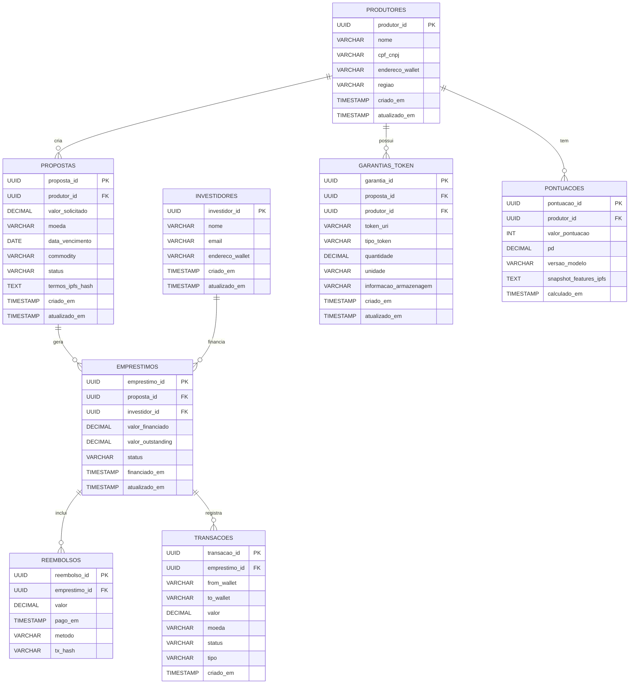
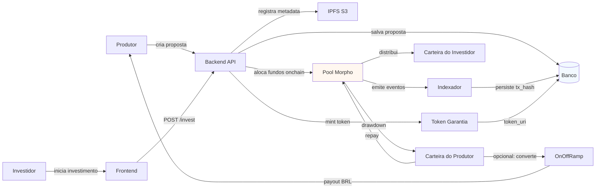

# Contexto

O setor agrícola brasileiro representa um dos pilares fundamentais da economia nacional, movimentando aproximadamente R$ 700 bilhões anuais em crédito rural e sendo responsável por mais de 25% do PIB do país. Pequenos e médios produtores rurais, que compõem a maioria dos estabelecimentos agropecuários brasileiros, enfrentam sistematicamente o desafio do descasamento temporal entre investimentos necessários para o plantio e o retorno financeiro da comercialização da safra. Durante os 6 a 12 meses que compreendem um ciclo produtivo típico, estes produtores necessitam de capital para aquisição de insumos essenciais como sementes certificadas, defensivos agrícolas, fertilizantes e eventualmente locação de maquinário, mas só conseguem gerar receita após a colheita e venda dos produtos.

O sistema bancário tradicional, embora ofereça linhas de crédito rural, apresenta limitações significativas que dificultam o acesso ao capital por parte destes produtores. As taxas de juros praticadas pelas instituições financeiras convencionais variam entre 18% e 25% ao ano para este segmento, valores considerados elevados quando comparados à rentabilidade típica da atividade agrícola. Além disso, as exigências de garantias são complexas e muitas vezes inacessíveis para pequenos produtores, incluindo avaliações de propriedades, seguros rurais e comprovações burocráticas extensas que podem levar meses para serem processadas. Este cenário cria um gargalo estrutural que limita a capacidade de expansão e modernização da agricultura familiar e de médio porte.

Paralelamente, o mercado financeiro brasileiro tem testemunhado o crescimento exponencial de investidores pessoa física em busca de alternativas de investimento que ofereçam retornos superiores aos produtos tradicionais de renda fixa. Investidores têm buscado diversificar suas carteiras com produtos alternativos que possam oferecer rendimentos ainda mais atrativos e diferenciação de risco, incluindo fundos imobiliários, criptomoedas e investimentos em fintechs. Simultaneamente, o conceito de empréstimos peer-to-peer tem ganhado tração global, permitindo que pessoas físicas emprestem diretamente para outras pessoas ou empresas, eliminando intermediários bancários e oferecendo melhores condições tanto para tomadores quanto para investidores.

A convergência de tecnologias emergentes como blockchain e machine learning tem criado novas possibilidades para mitigação de riscos e automação de processos financeiros no setor agrícola. Smart contracts baseados em blockchain podem automatizar liberações de pagamento com base em critérios pré-estabelecidos, garantindo transparência total das operações, pois todas as transações e condições ficam registradas de forma imutável. Além disso, os dados de crédito podem ser avaliados considerando a reputação de cada produtor, permitindo análises de histórico de empréstimos, adimplência e cumprimento de pagamentos. À medida que a reputação do produtor cresce com pagamentos realizados corretamente, seus limites de crédito disponíveis podem aumentar, criando um sistema dinâmico de confiança.

Com base nessa reputação, também é possível classificar o risco para o investidor que está disponibilizando o capital, fornecendo uma visão clara do perfil de risco associado a cada operação. Algoritmos de inteligência artificial podem combinar dados históricos de safras, preços de commodities e comportamento de crédito para ajustar automaticamente a avaliação de risco e propor condições de empréstimo mais seguras e personalizadas. Sistemas de análise antifraude podem validar informações de produtores através de bases de dados públicas como INCRA e Receita Federal, oferecendo camadas adicionais de segurança e transparência para investidores.


## Proposta: Marketplace de Crédito Agrícola P2P (agricultores ↔ investidores)


Plataforma marketplace que conecta produtores rurais (tomadores) a investidores (provedores de capital). Produtores tokenizam parte da colheita como garantia (recibos, notas de armazenagem, NFTs) e solicitam empréstimos para financiar insumos até a venda da safra. Investidores avaliam propostas com métricas de risco (score on‑chain/off‑chain, preços de commodities via oráculos) e decidem financiar total ou parcialmente operações.

### Objetivos principais

- Reduzir o custo do crédito para pequenos e médios produtores rurais.
- Conectar diretamente produtores e investidores, eliminando intermediários.
- Oferecer alternativas de investimento com rendimento ajustado ao risco.
- Garantir transparência e imutabilidade das operações via blockchain.
- Automatizar pagamentos, liquidações e análises de risco com smart contracts e oráculos.
- Integrar meios de pagamento (Pix, gateways, stablecoins) para flexibilidade.

---

## 3. Estrutura de Banco de Dados

Diagrama de Entidade-Relacionamento (DER)



### Descrição das Entidades

#### PRODUTORES
- Armazena informações dos produtores (tomadores de empréstimo).
	- produtor_id (PK): Identificador único do produtor (UUID).
	- nome: Nome ou razão social do produtor (VARCHAR).
	- cpf_cnpj: Documento fiscal (CPF ou CNPJ) (VARCHAR).
	- endereco_wallet: Endereço de carteira on‑chain vinculado ao produtor (VARCHAR).
	- regiao: Município / estado da produção (VARCHAR).
	- criado_em / atualizado_em: Data e hora de criação e atualização do registro (TIMESTAMP).

#### INVESTIDORES
- Dados dos investidores que fornecem capital.
	- investidor_id (PK): Identificador único do investidor (UUID).
	- nome: Nome ou razão social (VARCHAR).
	- email: Contato principal (VARCHAR).
	- endereco_wallet: Endereço on‑chain do investidor (VARCHAR).
	- criado_em / atualizado_em: Timestamps (TIMESTAMP).

#### PROPOSTAS
- Propostas de empréstimo criadas pelos produtores.
	- proposta_id (PK): Identificador único da proposta (UUID).
	- produtor_id (FK): Referência ao produtor que criou a proposta (UUID).
	- valor_solicitado: Montante requerido (DECIMAL).
	- moeda: Moeda do empréstimo (ex.: BRL, USDT, USDC) (VARCHAR).
	- data_vencimento: Data prevista para liquidação (DATE).
	- commodity: Produto agrícola que lastreia a proposta (ex.: soja, milho) (VARCHAR).
	- status: Estado da proposta (ABERTA / FINANCIADA / CANCELADA / VENCIDA) (VARCHAR).
	- termos_ipfs_hash: Hash ou link no IPFS com termos e documentos (TEXT).
	- criado_em / atualizado_em: Timestamps (TIMESTAMP).

#### EMPRESTIMOS
- Empréstimos efetivamente financiados a partir das propostas.
	- emprestimo_id (PK): Identificador único do empréstimo (UUID).
	- proposta_id (FK): Referência à proposta base (UUID).
	- investidor_id (FK): Investidor que financiou (UUID).
	- valor_financiado: Valor efetivamente liberado (DECIMAL).
	- valor_outstanding: Saldo devedor atual (DECIMAL).
	- status: Estado do empréstimo (ATIVO / LIQUIDADO / INADIMPLENTE) (VARCHAR).
	- financiado_em / atualizado_em: Timestamps (TIMESTAMP).

#### GARANTIAS_TOKEN
- Representação tokenizada das garantias (NFTs, recibos de armazenagem).
	- garantia_id (PK): Identificador único da garantia (UUID).
	- proposta_id (FK): Proposta vinculada (UUID).
	- produtor_id (FK): Dono da garantia (UUID).
	- token_uri: URI ou hash do token (IPFS) (VARCHAR).
	- tipo_token: Tipo do token (ERC721 / ERC1155 / RECEIPT) (VARCHAR).
	- quantidade / unidade: Ex.: 1000 sacas, toneladas (DECIMAL / VARCHAR).
	- informacao_armazenagem: Local de armazenagem / depósito (VARCHAR).
	- criado_em / atualizado_em: Timestamps (TIMESTAMP).

#### REEMBOLSOS
- Registros de pagamentos realizados pelos produtores.
	- reembolso_id (PK): Identificador do reembolso (UUID).
	- emprestimo_id (FK): Empréstimo associado (UUID).
	- valor: Quantia paga (DECIMAL).
	- pago_em: Data do pagamento (TIMESTAMP).
	- metodo: Meio de pagamento (on‑chain / off‑chain: Pix, boleto) (VARCHAR).
	- tx_hash: Hash da transação on‑chain (se houver) (VARCHAR).

#### PONTUACOES
- Histórico de pontuações (score) dos produtores.
	- pontuacao_id (PK): Identificador do registro de pontuação (UUID).
	- produtor_id (FK): Produtor avaliado (UUID).
	- valor_pontuacao: Score numérico (0–1000) (INT).
	- pd: Probabilidade de inadimplência (0–1) (DECIMAL).
	- versao_modelo: Versão do modelo de cálculo (VARCHAR).
	- snapshot_features_ipfs: Snapshot das features usado no cálculo (IPFS) (TEXT).
	- calculado_em: Data do cálculo (TIMESTAMP).

#### TRANSACOES
- Movimentações financeiras registradas (on‑chain ou reconciliadas off‑chain).
	- transacao_id (PK): Identificador da transação (UUID).
	- emprestimo_id (FK): Empréstimo relacionado (opcional) (UUID).
	- from_wallet / to_wallet: Carteiras de origem e destino (VARCHAR).
	- valor: Quantia movimentada (DECIMAL).
	- moeda: Tipo de moeda (BRL / USDT / ETH) (VARCHAR).
	- status: PENDENTE / CONFIRMADA / FALHA (VARCHAR).
	- tipo: LOAN / REEMBOLSO / SEIZURE (VARCHAR).
	- criado_em: Timestamp de criação (TIMESTAMP).

### Considerações de Arquitetura

#### Segurança
- Criptografia de dados sensíveis (PII) em repouso e em trânsito.
- Campos de KYC encriptados.
- Uso de vault para gerenciamento seguro de chaves.

#### Consistência
- Transações ACID para operações financeiras críticas.
- Uso de filas (RabbitMQ/Kafka) para conciliação eventual entre eventos on‑chain e off‑chain.

#### Escalabilidade
- Sharding por região ou commodity, se necessário.
- Read‑replicas para consultas analíticas.

#### Auditoria
- Triggers e tabelas de `_audit_log_` para alterações críticas (mudança de status, drawdown, seize de garantia).

#### Gestão de Risco
- Tabela `risk_profiles` consolidando LTV, score, PD e recomendações por empréstimo.

## 4. Estrutura de Front-end

### Arquitetura do Front-end

A aplicação front-end será desenvolvida utilizando React.js com TypeScript, proporcionando uma base sólida para desenvolvimento escalável e manutenível. A arquitetura seguirá o padrão de componentes reutilizáveis e gerenciamento de estado centralizado.

### Tecnologias Principais

- React.js 18+: Framework principal para construção da interface de usuário
- TypeScript: Para tipagem estática e melhor experiência de desenvolvimento
- React Router: Para navegação entre páginas
- Axios: Para comunicação com APIs
- React Hook Form: Para gerenciamento de formulários

### Estrutura de Componentes 

```text
src/
├── components/
│   ├── common/
│   │   ├── Header.tsx
│   │   ├── Sidebar.tsx
│   │   ├── Footer.tsx
│   │   └── LoadingSpinner.tsx
│   ├── forms/
│   │   ├── PaymentForm.tsx
│   │   ├── UserRegistrationForm.tsx
│   │   └── MerchantForm.tsx
│   ├── dashboard/
│   │   ├── TransactionChart.tsx
│   │   ├── BalanceCard.tsx
│   │   └── RecentTransactions.tsx
│   └── payments/
│       ├── PaymentButton.tsx
│       └── QRCodeGenerator.tsx
├── pages/
│   ├── Dashboard.tsx
│   ├── Transactions.tsx
│   ├── Users.tsx
│   ├── Merchants.tsx
│   └── Settings.tsx
├── hooks/
│   ├── useAuth.ts
│   ├── useTransactions.ts
│   └── usePayments.ts
├── services/
│   ├── api.ts
│   ├── paymentService.ts
├── types/
│   ├── user.ts
│   ├── transaction.ts
│   └── merchant.ts
└── utils/
	├── formatters.ts
	├── validators.ts
	└── constants.ts
```

### Principais Funcionalidades da Interface

- Dashboard Administrativo: visão geral das transações, usuários ativos e métricas de performance; gráficos interativos (volume, métodos, tendências).
- Gerenciamento de Usuários: visualizar, editar e gerenciar usuários, métodos de pagamento e histórico de transações.
- Painel de Transações: listagem detalhada com filtros por data, status, valor e tipo; busca e exportação.


### Responsividade e Acessibilidade

A interface será totalmente responsiva, adaptando-se a diferentes tamanhos de tela (desktop, tablet, mobile). Seguirá as diretrizes de acessibilidade WCAG 2.1.

### Segurança no Front-end

- Autenticação JWT: Tokens seguros para autenticação de usuários.
- Validação de entrada: validação rigorosa de todos os dados inseridos no cliente.
- Sanitização: prevenção contra ataques XSS e injeção.
- HTTPS obrigatório: todas as comunicações criptografadas.

---

## 5. Fluxos e Integrações

Abaixo os fluxos principais, simplificados e organizados em partes para facilitar a visualização.

Dashboard → Investimento
- O que acontece: o investidor vê propostas disponíveis no dashboard.
- Ação: ao clicar em "Investir", o frontend envia uma requisição ao Backend API.
- Resultado: o Backend registra a intenção no banco e inicia o processo de funding (on‑chain ou via gateway); o status é exibido ao usuário.

Financiamento → Drawdown
- O que acontece: o investidor financia total ou parcialmente uma proposta.
- Ação: os fundos são alocados no mercado de lending (ex.: Morpho) via transação on‑chain.
- Resultado: quando liberado, o drawdown transfere os fundos para a carteira do produtor; o Backend persiste o tx_hash e atualiza o status no banco.

Recebimento / Conversão
- O que acontece: o produtor recebe cripto na carteira.
- Ação: se precisar de reais, o produtor solicita conversão via parceiro on/off‑ramp.
- Resultado: o parceiro realiza o payout em BRL; o Backend registra a confirmação.

Repagamento
- O que acontece: após a venda da safra o produtor faz o repay on‑chain.
- Ação: repay() no protocolo distribui os valores aos investidores.
- Resultado: o evento é capturado e o Backend atualiza reembolsos e saldos; tx_hash fica armazenado para auditoria.

Tokenização de Garantia
- O que acontece: colheita/recibo é tokenizada (NFT/receipt).
- Ação: o Backend pede mint do token e grava o token_uri/metadata.
- Resultado: o token serve como garantia vinculada à proposta; o hash/URI é salvo no banco.

Armazenamento e Verificação (IPFS / KYC)
- O que acontece: documentos e snapshots são armazenados e KYC é verificado.
- Ação: o Backend envia documentos para storage (IPFS/S3) e requisita verificação KYC quando necessário.
- Resultado: hashes/links e status KYC são salvos para consulta e compliance.

Diagrama simplificado (Mermaid)



---

## 6. Exemplo de estrutura

Resumo
- Exemplos minimalistas para ilustrar a integração entre frontend, backend, indexador on‑chain e persistência (Postgres). Stack sugerido: Node.js + TypeScript (Fastify), Prisma, ethers.js, React + TypeScript + Tailwind.

### Backend API (Node.js + TypeScript)
O backend expõe uma API REST/HTTP e handlers para eventos on‑chain. Responsabilidades principais:
- Endpoints: criar/listar propostas, iniciar investimento, emitir drawdown, registrar reembolsos.
- Indexador: consome eventos (LoanCreated, Repayment) e persiste tx_hash + payload_raw.
- Integrações: IPFS (metadata), Morpho (pool), on/off‑ramp (conversão), KYC.
- Segurança: autenticação JWT, validação de requests e uso de vault para secrets.

Principais funcionalidades:
- POST /propostas — cria proposta e grava termos_ipfs_hash.
- POST /investimentos — registra intenção e aciona funding on‑chain.
- Webhook/Listener on‑chain — persiste eventos com tx_hash para auditoria.

### Frontend Dashboard (React + TypeScript)
Interface para investidores e produtores:
- Componentes: lista de propostas, formulário de criação de proposta, fluxo de investimento e visualização de status on‑chain.
- Integração wallet: conectar MetaMask/WalletConnect para assinar transações on‑chain.
- UX: mostrar status do tx (PENDENTE → CONFIRMADA) consultando records off‑chain (tx_hash) e consultas on‑chain.

Componentes principais:
- ProposalList, ProposalForm, InvestModal, LoanStatusCard.

### Estrutura do Banco de Dados (Postgres) — características
- UUIDs para PKs; JSONB para raw events e metadados.
- Indices em tx_hash, proposta_id, emprestimo_id.
- Tabelas relevantes: propostas, emprestimos, reembolsos, transacoes, eventos_onchain, garantias_token, pontuacoes.
- Boas práticas: constraints, FK, e jobs de reconciliação on‑chain ↔ off‑chain.


### Exemplo de fluxo completo (simplificado)
1. Investidor clica em "Investir" no dashboard → Frontend POST /investimentos → Backend cria registro e aciona transação on‑chain (via ethers.js).
2. Transação on‑chain é emitida em Morpho → Indexador captura LoanCreated com tx_hash e persiste em eventos_onchain.
3. Backend atualiza EMPRESTIMOS com morpho_tx_hash → UI exibe status com link para explorer.
4. Quando produtor repay(), Indexador captura Repayment → Backend marca REEMBOLSOS e atualiza saldos dos investidores.

Segurança e operação
- Validar origem dos eventos on‑chain (address do contrato).
- Trabalhar com N confirmações antes de considerar a operação finalizada.
- Rastrear raw_event_json para auditoria.


## 7. Considerações de Implementação

**Infra & serviços**:
- API: Node.js 18+ (Fastify/Express)
- DB: PostgreSQL 13+
- Storage: IPFS/S3
- Blockchain: Rede EVM (Polygon/Gnosis)
- Oráculos: Chainlink ou custom
- CI/CD: GitHub Actions

**Segurança & compliance**:
- Auditoria de smart contracts
- Vault para segredos
- KYC e verificação documental (INCRA/Receita onde possível)


**KPIs sugeridos**
- Produtores cadastrados e investidores ativos
- Volume financiado por mês
- % loans em default
- Latência de funding/drawdown

---

## Próximos passos práticos

1. Gerar esqueleto do backend (Prisma + Fastify) e migrações do schema.
2. Criar smart contract MVP (Proposal/Loan/Collateral) em Solidity.
3. Desenvolver frontend minimal para criar proposals e investir (integração wallet).
4. Implementar pipeline inicial de score com dados sintéticos e endpoint de cálculo.
