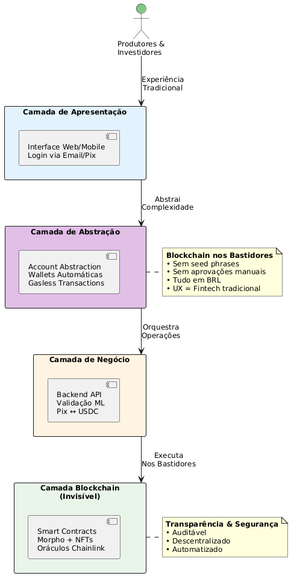

# MVP - Marketplace de Crédito Agrícola P2P

## Visão Geral

O projeto propõe a criação de um **marketplace de crédito agrícola P2P (MVP)** que conecta diretamente produtores rurais e investidores, utilizando tecnologia blockchain para oferecer transparência, eficiência e segurança. A plataforma resolve uma dor histórica do setor: o acesso limitado e caro ao crédito agrícola tradicional, marcado por intermediários, burocracia e taxas elevadas.

### Escopo do MVP
Para validar a viabilidade técnica e de mercado, o MVP opera com:
- **1 commodity**: Soja (maior liquidez e padronização no mercado)
- **1 região**: Mato Grosso (infraestrutura de armazéns estabelecida)
- **Volume controlado**: Máximo 10 empréstimos simultâneos

Na solução proposta, os produtores rurais podem **tokenizar sua produção futura**, utilizando recibos de armazenagem digitalizados. Esses ativos funcionam como garantias dentro do protocolo, permitindo que empréstimos sejam concedidos de forma mais ágil e com custos reduzidos.

Do outro lado, investidores acessam uma oportunidade de aplicação atrelada ao agronegócio, com métricas claras de risco e retorno. A plataforma oferece indicadores como **Loan-to-Value (LTV)** baseado em oráculos de preço da soja, além de informações sobre histórico e reputação do produtor.

O resultado é um sistema em que o crédito deixa de depender de instituições financeiras tradicionais e passa a operar em um modelo **peer-to-peer**, sustentado por contratos inteligentes auditáveis que funcionam de forma transparente nos bastidores. Essa abordagem aumenta a previsibilidade para o produtor, gera novas oportunidades de investimento e promove maior inclusão financeira no campo.

---

## Arquitetura e Stack Tecnológico

A plataforma é organizada em camadas bem definidas, cada uma responsável por uma função crítica no ecossistema de crédito agrícola.

**Camada Blockchain:** A infraestrutura base utiliza **Base** (L2 da Coinbase), permitindo transações rápidas e econômicas, com boa liquidez USDC e suporte robusto. Essa camada opera de forma transparente, com usuários nunca precisando interagir diretamente com a blockchain.

**Protocolo de Empréstimo:** No núcleo da plataforma, o **Morpho Blue** gerencia 1-2 mercados de empréstimos isolados para soja, com regras de LTV e taxas específicas, otimizando segurança e eficiência.

**Stablecoin:** Para liquidez e estabilidade financeira, a plataforma opera exclusivamente com **USDC** no MVP, porém apresentado ao usuário sempre em **valores BRL equivalentes** para familiaridade.

**Oráculos:** A precificação das garantias é feita por **Chainlink**, que fornece preços da soja atualizados. Como fallback, admins podem atualizar preços manualmente via multi-sig em casos emergenciais.

**Colateral:** NFTs **ERC-721 simplificados** representam lotes de soja depositados em armazéns certificados, contendo metadados essenciais (quantidade, localização, data de depósito, hash do certificado CDA/WA). Para o usuário, isso é apresentado como "Certificado Digital de Garantia".

**Frontend:** A interface do usuário é construída em **Next.js 14** com **TypeScript**, oferecendo experiência web tradicional sem referências explícitas a blockchain. Sistema exibe dashboards intuitivos: propostas de empréstimo, investimentos disponíveis, monitoramento de posições e indicadores de risco em linguagem acessível.

**Account Abstraction (ERC-4337):** Cada usuário recebe uma **smart contract wallet** criada automaticamente no primeiro acesso, sem necessidade de instalar extensões ou gerenciar chaves privadas. Features incluem:
- **Social login**: Cadastro via email, telefone ou Google/Apple
- **Gasless transactions**: Plataforma paga gas fees em nome do usuário (meta-transactions)
- **Recovery**: Recuperação de conta via email/SMS, sem seed phrases
- **Batch operations**: Múltiplas ações em uma única transação para melhor UX
- **Session keys**: Permissões temporárias para operações rotineiras sem aprovar cada ação

**Backend e Infraestrutura:** Um backend em **Node.js + Express** gerencia lógica off-chain, autenticação de usuários, validação automatizada de documentos, scoring e histórico de transações, com dados armazenados em **PostgreSQL**. Metadados de NFTs são mantidos em **IPFS via Pinata**. O frontend é hospedado em **Vercel**, o backend em **Railway/Render**, e nodes RPC são fornecidos por **Alchemy**.

**Validação Automatizada & ML:**
- **OCR + Computer Vision**: Extração automática de dados de documentos (CPF, CNH, CDA/WA)
- **Validação de documentos**: Modelos ML verificam autenticidade de certificados e assinaturas
- **Scoring básico**: Análise de histórico de transações na plataforma e dados fornecidos
- **Anti-fraude**: Detecção de padrões suspeitos e documentos alterados

**Conversão Fiat-Crypto:** Integração com **on/off-ramp partners** (MoonPay, Ramp Network, Transak) permite que usuários depositem/retirem via **Pix** sem interagir diretamente com crypto. O fluxo é: Pix → USDC (invisível) → Empréstimo, e na volta: Repagamento → USDC (invisível) → Pix.

Essa arquitetura abstrai completamente a complexidade blockchain, permitindo que o MVP seja operacional e acessível para usuários sem conhecimento técnico, validando a hipótese central do negócio com experiência de usuário equivalente a fintechs tradicionais.

---

## Fluxos Operacionais

A plataforma contempla três fluxos principais: solicitação de empréstimo pelo produtor, fornecimento de capital pelo investidor e liquidação/repagamento dos empréstimos. Cada fluxo abstrai a complexidade blockchain, oferecendo experiência intuitiva equivalente a aplicações web tradicionais.

### 1. Fluxo do Produtor: Solicitação de Empréstimo

O produtor inicia o processo com **cadastro simplificado**. Ele acessa a plataforma via web/mobile e faz login com email/telefone ou Google/Apple ID. No primeiro acesso, uma **smart contract wallet é criada automaticamente nos bastidores** via Account Abstraction - o produtor não percebe isso e não precisa gerenciar chaves ou extensões. 

Ele preenche um formulário com documentos básicos: CPF, CNH, comprovante de propriedade rural. **Sistema de ML valida automaticamente** os documentos via OCR e computer vision, verificando autenticidade e extraindo dados. O processo leva minutos, não dias. Um **perfil de risco inicial** é calculado baseado nos dados fornecidos.

Em seguida, a produção é **tokenizada de forma transparente**. O produtor deposita a soja em um dos **armazéns parceiros integrados** no Mato Grosso. O armazém emite CDA/WA digital e notifica a plataforma via API. O sistema:
- Valida automaticamente a assinatura digital e certificação do armazém
- **Cria NFT de colateral nos bastidores** (apresentado ao usuário como "Certificado Digital de Garantia")
- Disponibiliza visualização dos metadados em linguagem simples: "Você tem 1.000 sacas de soja depositadas no Armazém XYZ, avaliadas em R$ XXX"

O produtor então **cria a proposta de empréstimo** com interface intuitiva, definindo:
- Valor desejado (apresentado sempre em **BRL**, conversão USDC é transparente)
- Prazo (3-6 meses)
- Taxa máxima aceitável (ou aceita sugestão do sistema)

O sistema calcula e exibe automaticamente:
- **LTV** baseado no preço da soja (explicado como "% do valor da garantia")
- **Classificação de risco** (A, B, C com explicação visual)
- **Taxa de juros sugerida** baseada no perfil
- **Simulações**: quanto vai pagar no total, parcelas, etc

Quando investidores fornecem liquidez suficiente (fundado 100%), o produtor é notificado. O **dinheiro é depositado via Pix** diretamente na conta bancária dele em minutos - toda a conversão USDC e transações blockchain acontecem automaticamente nos bastidores.

### 2. Fluxo do Investidor: Fornecimento de Capital

O investidor realiza **onboarding similar**: login via email/telefone, **smart contract wallet criada automaticamente**, KYC simplificado com validação ML de documentos.

Para adicionar capital, duas opções simples:
- **Pix direto**: Investidor transfere via Pix, sistema converte para USDC automaticamente e credita na conta dele (apresentado sempre em BRL)
- **Crypto direto**: Para investidores avançados, possibilidade de depositar USDC de outras wallets

O investidor **navega pelas oportunidades** com filtros intuitivos:
- Ordenar por: maior retorno, menor risco, prazo
- Filtrar por: classificação de risco (A/B/C), retorno anual, prazo, produto produzido pelo agricultor
- Visualizar detalhes de cada empréstimo em **linguagem de negócio tradicional**:
  - "Produtor com bom histórico solicita R$ 100k"
  - "Garantia: 1.000 sacas de soja (valor R$ 150k)"
  - "Retorno: 12% ao ano"
  - "Risco: Baixo (A)"
  - "Margem de segurança: 50%" (LTV apresentado de forma compreensível)

O investidor seleciona quanto quer investir e confirma. **Transação blockchain acontece nos bastidores** - investidor só vê "Investimento confirmado" e seu saldo sendo atualizado instantaneamente.

Dashboard mostra:
- Investimentos ativos
- Juros acumulados (atualizados diariamente, não por bloco)
- Status de cada empréstimo
- Alertas em linguagem simples: "Atenção: Preço da soja caiu, margem de segurança reduzida para 30%"

### 3. Fluxo de Repagamento e Liquidação

No **cenário positivo de repagamento**, o produtor:
- Acessa dashboard e vê valor total devido (principal + juros)
- Clica em "Pagar via Pix"
- Faz transferência Pix para conta da plataforma
- Sistema converte para USDC automaticamente e executa repagamento via smart contract
- Investidores recebem conta e saldo fica disponível para reinvestir ou fazer uma retirada via pix

Todo o fluxo blockchain (distribuição proporcional aos investidores, burn do NFT, atualização de contratos) acontece de forma transparente. O produtor vê: "Empréstimo quitado ✓" e pode retirar a soja do armazém.

No **cenário de inadimplência/liquidação**:

**Monitoramento e alertas em linguagem simples**:
- Sistema monitora "Margem de Segurança" (health factor) continuamente
- Alertas progressivos:
  - "Atenção: Margem caiu para 20%, considere adicionar mais garantia"
  - "Urgente: Você tem 48h para regularizar ou a garantia será vendida"

**Liquidação automatizada (nos bastidores)**:
- Se margem chega a zero, smart contract aciona liquidação automaticamente
- Sistema busca compradores para a garantia (via leilão on-chain)
- **Para o investidor**: Notificação simples "Empréstimo liquidado, você recebeu R$ XXX via Pix (perda de Y%)"
- **Para o produtor**: "Sua garantia foi vendida para cobrir a dívida"

Esses fluxos abstraem completamente a complexidade blockchain, oferecendo experiência equivalente a fintechs como Nubank ou PicPay, enquanto mantêm todos os benefícios de transparência, auditabilidade e descentralização nos bastidores.

---

## Arquitetura da Solução

A plataforma é construída em camadas modulares que garantem operação automatizada com blockchain invisível ao usuário final. O **frontend** oferece experiência web tradicional sem jargão técnico, exibindo empréstimos, investimentos e indicadores em linguagem de negócio. O **Account Abstraction Layer** gerencia smart contract wallets, gasless transactions e social recovery, permitindo que usuários interajam sem conhecimento de blockchain. O **backend off-chain** processa autenticação, KYC automatizado via ML, validação de documentos, conversões fiat-crypto via on/off-ramp e orquestra transações blockchain em nome dos usuários. A **blockchain layer** registra colaterais tokenizados, operações de empréstimo via Morpho Blue e liquidações automáticas de forma transparente. **Oráculos Chainlink** atualizam preços continuamente. **The Graph** indexa dados on-chain para analytics em tempo real. **Admins multi-sig** intervêm apenas em emergências sistêmicas.

O diagrama abaixo ilustra a arquitetura geral e o fluxo de interação entre os componentes:

Esse diagrama mostra como produtores e investidores interagem com uma interface tradicional, como a camada de Account Abstraction esconde toda complexidade blockchain, como o backend orquestra conversões Pix-crypto e valida documentos via ML, e como os contratos inteligentes e oráculos operam de forma transparente garantindo segurança e auditabilidade sem comprometer a experiência do usuário.

---